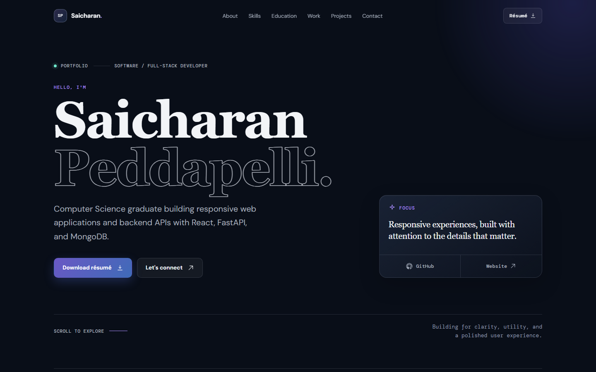
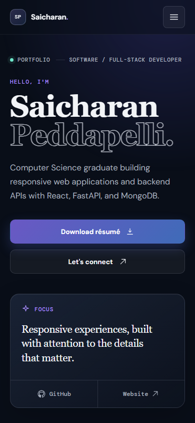

# Saicharan Peddapelli — Portfolio

<p align="center">
  <strong>Personal portfolio website</strong><br>
  A single-page React + Vite build with an editorial dark theme and a hand-written CSS Modules design system.
</p>

<p align="center">
  <a href="https://saicharanpeddapelli.in"></a>
  
  
  
  
  
</p>

<p align="center">
  
  
</p>

---

## ✨ About

This repository contains my personal portfolio website — a single-page application that presents my **skills, projects, experience, education, certifications, and contact details**.

The visual language is an editorial dark theme: Playfair Display for headings, DM Sans for body copy, and DM Mono for micro-labels, over a near-black surface with violet and mint accents. Colour, spacing, typography and layout are driven by a small set of CSS custom properties, so the whole site can be re-tuned from one place.

Everything is static — no backend, no router, no state manager, no component library. Just React, CSS Modules and Vite.

## 🛠️ Built With

| Layer | Choice |
| --- | --- |
| UI library | **React 19** (`react`, `react-dom`) with `StrictMode` |
| Build tool | **Vite 6** (`@vitejs/plugin-react`) — dev server and production bundler |
| Styling | **CSS Modules** (`src/App.module.css`) plus global resets and tokens (`src/index.css`) |
| Language | JavaScript (JSX) |
| Typography | Google Fonts — Playfair Display, DM Sans, DM Mono, loaded with `preconnect` and `display=swap` |
| Runtime dependencies | React only — no routing, state, icon or animation packages |

Icons are inline SVG components inside `src/App.jsx` (an `Icon` helper with a name → path map), so no icon font or icon package is shipped in the bundle.

## 🚀 Getting Started

### Prerequisites

* **Node.js** `^18.0.0 || ^20.0.0 || >=22.0.0` — the range Vite 6 supports — and npm.
* No global tooling, database or API keys are required.

Developed and verified with Node 24.15.0 and npm 11.12.1.

### Installation

Clone the repository and install the dependencies:

```bash
git clone https://github.com/saicharan-cmd/saicharan-portfolio.git
cd saicharan-portfolio
npm install
```

### Run Locally

Start the development server with hot module reloading:

```bash
npm run dev
```

Then open the local URL printed by Vite (usually `http://localhost:5173`).

### Available Scripts

| Command | Description |
| --- | --- |
| `npm run dev` | Start the Vite dev server with hot module reloading |
| `npm run build` | Create the production bundle in `dist/` (minified JS + CSS) |
| `npm run preview` | Serve the built `dist/` locally to check the production output |

## 📦 Production Build

Create an optimized production build:

```bash
npm run build
```

The generated files are written to `dist/`, ready to be uploaded to any static host:

```text
dist/
├── assets/
│   ├── index-*.js                          # ~240 KB minified (~74 KB gzipped)
│   └── index-*.css                         # ~26 KB minified (~6 KB gzipped)
├── favicon.svg
├── Saicharan_Peddapelli_Resume.pdf
├── machine-learning-foundation-certificate.pdf
└── index.html
```

To inspect the production output locally before deploying:

```bash
npm run preview
```

## 📁 Project Structure

```text
.
├── public/                                 # Copied to the site root as-is
│   ├── favicon.svg
│   ├── Saicharan_Peddapelli_Resume.pdf
│   └── machine-learning-foundation-certificate.pdf
├── src/
│   ├── App.jsx                             # Content object, helpers and page structure
│   ├── App.module.css                      # Design tokens and every component style
│   ├── index.css                           # Reset, font families, global a11y rules
│   └── main.jsx                            # React root
├── docs/                                   # Preview screenshots used by this README
├── index.html                              # Page shell: meta tags, preconnects, favicon
├── package.json
└── README.md
```

### Key Files

| File | Description |
| --- | --- |
| `src/App.jsx` | The `portfolio` content object, the `Icon` / `Reveal` / `SectionHeader` / `ButtonLink` helpers, and the hero plus eight content sections |
| `src/App.module.css` | Scoped component styles, the design-token block (`.page`) and every responsive tier |
| `src/index.css` | Global reset, dark `color-scheme`, font-family tokens, focus ring and reduced-motion defaults |
| `index.html` | Document shell: description meta, theme colour, font preconnects, favicon |
| `public/` | Static assets served from `/` — résumé, certificate and favicon |

## 🧭 Site Sections

| # | Section | Anchor | Header navigation |
| --- | --- | --- | --- |
| — | Hero | `#top` | Brand mark |
| 01 | About me | `#about` | About |
| 02 | Technical toolkit | `#skills` | Skills |
| 03 | Education | `#education` | Education |
| 04 | Hands-on experience | `#experience` | Work |
| 05 | Selected projects | `#projects` | Projects |
| 06 | Certifications & achievements | `#achievements` | — |
| — | Résumé | `#resume` | Résumé button |
| — | Contact | `#contact` | Contact |

A "Skip to content" link is the first focusable element on the page and jumps straight to `#about`.

## ✏️ Updating Content

All copy lives in a single `portfolio` object at the top of `src/App.jsx`, so most edits never touch JSX:

| Key | Drives |
| --- | --- |
| `name`, `initials`, `title` | Hero heading, brand mark, hero kicker |
| `summary`, `focus` | About paragraph and the "Professional focus" note |
| `strengths`, `skills`, `developmentAreas` | About sidebar, toolkit cards and "Relevant development areas" |
| `education`, `projects`, `certifications` | Timeline, project cards and certificate card |
| `email`, `phone`, `github`, `linkedin`, `website` | Contact cards, hero buttons and footer links |

Notes:

* Header links come from the `navItems` array near the top of `App.jsx` — extend it with a `[label, sectionId]` pair to add another destination.
* A project's `technologies` list is optional; the tech chips on the card are only rendered when it is present.
* To swap the résumé or the certificate, replace the PDF in `public/`. If you rename a file, update the `href`/`download` pairs that reference it (header, hero, résumé section and mobile menu for the résumé; two references inside the certificate card).
* To re-theme the site, edit the token block at the top of `src/App.module.css` — for example `--violet` and the `--cta` gradient.

## 🎨 Design System

The whole interface is themed from the token block at the top of `src/App.module.css` (`.page`), so a single edit propagates through every section.

### Colour & surfaces

| Token | Value | Used for |
| --- | --- | --- |
| `--ink` | `#f2f4f7` | Headings and primary text |
| `--muted` | `#a7afbd` | Secondary text, navigation |
| `--dim` | `#8b95a7` | Micro-labels and meta rows |
| `--violet` | `#a78bfa` | Accent, eyebrows, focus ring |
| `--mint` | `#6ee7cb` | Status dot and bullet markers |
| `--surface` | `#090e18` | Page background |
| `--surface-1` / `--surface-2` | `rgba(255,255,255,.024)` / `rgba(255,255,255,.05)` | Card and control fills |
| `--line` / `--line-soft` | `rgba(198,210,231,.15)` / `rgba(198,210,231,.08)` | Borders and dividers |
| `--cta` | `linear-gradient(132deg, #6a58c4, #3f6bb8)` | Primary buttons (download résumé) |

### Layout & type scale

| Token | Value | Purpose |
| --- | --- | --- |
| `--gutter` | `clamp(20px, 5vw, 24px)` | Page side padding |
| `--content-max` | `1180px` | Maximum content width |
| `--indent` | `clamp(0px, 8.4vw, 98px)` | Editorial left indent used by section content |
| `--section-y` | `clamp(76px, 8.5vw, 124px)` | Vertical rhythm between sections |
| `--header-h` | `76px` (`68px` below 860px) | Fixed header height |
| `--radius-sm` / `--radius-md` / `--radius-lg` | `8px` / `14px` / `18px` | Corner rounding |
| `--label` / `--track` | `11px` / `0.11em` | Micro-label size and letter-spacing |

Headings are fluid rather than breakpoint-stepped: the hero is `clamp(3.7rem, 8.6vw, 8rem)/0.94` with `text-wrap: balance`, section headings are `clamp(2.05rem, 4vw, 3.75rem)/1.04`, and body copy uses `text-wrap: pretty`. The hero height is `min(830px, 100svh)` so it respects short laptop viewports instead of forcing a fixed height.

### Responsive breakpoints

| Breakpoint | What changes |
| --- | --- |
| `max-width: 1100px` | Hero and header grids rebalance; wide compositions tighten |
| `max-width: 900px` | About becomes a single column, `--indent` drops to `clamp(0px, 5vw, 44px)`, card padding reduces |
| `max-width: 860px` | Navigation collapses into the dropdown menu and the header height drops to `68px` |
| `max-width: 700px` | Everything stacks into one column, gutters settle at `20px`, `--indent: 0`, buttons go full width |
| `max-width: 420px` | Extra compression for small phones |
| `hover: hover` | Hover motion is applied only on pointer devices, so a tap never leaves a stuck hover state |
| `prefers-reduced-motion: reduce` | Transitions and scroll-reveal animations are switched off |

## ♿ Accessibility

* **Semantic landmarks** — `<main>`, `<header>`, `<nav aria-label="Primary navigation">` and `<footer>`, with every `<section>` labelled through `aria-labelledby` pointing at its own heading.
* **Skip link** — "Skip to content" is the first focusable element on the page and jumps straight to `#about`.
* **Mobile menu** — exposes `aria-expanded` and `aria-controls`, closes on `Escape`, on an outside pointer-down, on link activation, and automatically when the viewport crosses 861px; body scrolling is locked while it is open.
* **Focus visibility** — a `2px #a78bfa` outline with a 3px offset on every interactive element, and `scroll-padding-top: 92px` keeps anchor targets clear of the fixed header.
* **Touch targets** — all interactive elements measure at least 44×44px in the mobile tiers.
* **Motion** — `prefers-reduced-motion` is honoured in CSS and inside the scroll-reveal hook, so nothing animates for users who opt out.
* **Icon semantics** — decorative SVGs are `aria-hidden`, while icon-only links carry descriptive `aria-label`s (GitHub, website, project links, menu toggle).

### Contrast (WCAG 2.1)

Every text/background pair used by the site was measured against WCAG 2.1 and clears the AA threshold (4.5:1 for body text, 3:1 for large text and UI components). The tightest pair in the design is the white label on the darkest CTA gradient stop:

| Foreground | Background | Ratio |
| --- | --- | --- |
| `#f2f4f7` primary text | `#090e18` page | **17.52:1** |
| `#dbe1eb` chip / strong meta text | `#090e18` page | **14.69:1** |
| `#6ee7cb` mint accents | `#090e18` page | **12.83:1** |
| `#c8d0dd` about summary | `#090e18` page | **12.43:1** |
| `#c4c8dc` résumé panel copy | `#090e18` page | **11.62:1** |
| `#a7afbd` secondary text | `#090e18` page | **8.74:1** |
| `#a7afbd` secondary text | `#0f141e` card | **8.35:1** |
| `#a78bfa` violet accents | `#090e18` page | **7.09:1** |
| `#8b95a7` micro-labels | `#090e18` page | **6.39:1** |
| `#8b95a7` micro-labels | `#0f141e` card | **6.11:1** |
| `#f2f4f7` button label | `#6a58c4` CTA stop | **5.01:1** |
| `#f2f4f7` button label | `#3f6bb8` CTA stop | **4.76:1** |

## ⚡ Performance

* **Nothing beyond React** — no router, state manager, UI kit, icon package or animation library.
* **Lean bundle** — ~240 KB JS / ~26 KB CSS minified, roughly **74 KB + 6 KB gzipped** in total.
* **Efficient runtime** — scroll reveals use one `IntersectionObserver` per revealed block that unobserves itself as soon as it is visible and disconnects on unmount; the header state uses a single passive `scroll` listener, and every other effect is CSS-only.
* **Fonts** — three Google Fonts families requested with `preconnect` and `display=swap`, so text paints immediately with the fallback stack.
* **No layout shift** — the page has no images at all; the only binary assets are the two PDFs and the SVG favicon.

## 🧪 Checks Performed

The design pass behind this version was verified rather than eyeballed:

* **Layout audit at 13 viewport widths from 360px to 1440px** — no horizontal overflow at any width, and the document never exceeds the viewport.
* **Continuous type scale** — the hero heading grows smoothly from ~56px at 360px to ~124px at 1440px, with no jump where a breakpoint sits.
* **Single navigation flip** — the dropdown appears at exactly 860px and below, and the inline links return at 900px, so mid-size tablets never see a cramped nav row.
* **Tap targets** — every interactive element is at least 44×44px in the `max-width: 700px` tier.
* **Contrast** — all pairs tabulated above measured against WCAG 2.1, minimum 4.76:1.
* **Clean production build** — `npm run build` completes with no warnings, and the stylesheet contains no `!important` overrides.

## 🌐 Live Website

**[saicharanpeddapelli.in](https://saicharanpeddapelli.in)**

## 📌 Deployment

The site is fully static, so any static host works:

```bash
npm install
npm run build      # output is written to dist/
```

* Upload (or serve) the contents of **`dist/`** — `index.html`, `assets/`, the PDFs and the favicon.
* Because there is no client-side router — all navigation is in-page anchors — **no rewrite or redirect rules are needed**. An SPA fallback is optional.
* The production site is served over HTTPS on the custom domain **https://saicharanpeddapelli.in**. The `dist/` folder is gitignored, so it is always generated by the build step rather than committed.

## 📬 Contact

| Channel | |
| --- | --- |
| Email | [saicharanpeddapelli@proton.me](mailto:saicharanpeddapelli@proton.me) |
| Phone | [+91 88017 05149](tel:8801705149) |
| GitHub | [github.com/saicharan-cmd](https://github.com/saicharan-cmd) |
| LinkedIn | [saicharan-peddapelli](https://www.linkedin.com/in/saicharan-peddapelli-a98655229/) |
| Website | [saicharanpeddapelli.in](https://saicharanpeddapelli.in) |

## 📄 License

This is a personal portfolio: the content, copy, résumé and visual design are © Saicharan Peddapelli, so please don't republish them as your own. The source code is shared openly — feel free to read it and borrow patterns for your own site.

---

<p align="center">
  Made with ❤️ by <strong>Saicharan Peddapelli</strong>
</p>
